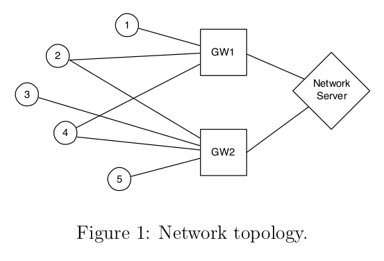

# Challenges_and_Project_IoT_2023

<!-- PROJECT LOGO -->
 

  

<h3 align="center">Challenges and Project IoT 2023</h3>
 

<!-- ABOUT THE PROJECT -->
## Challenges :boom:

### Challenge 2:

The second challenge was about Node-Red. 

Starting from a csv file, we had to pseudo-randomly choose a row and check the type of the message: if it was an MQTT publish, we had to publish a message to a topic specified in the requirements.

Then, the Node-Red flow had to subscribe to that topic, get the messages we were publishing, keep only those messages which temperature measure was in Celsius, and create a temperature chart with those values.

For more information on the assignment, check [here](Challenges/Challenge_2/resources/Challenge2.pdf).

The main functionalities of row-extraction in the csv file and of message-filtering were implemented in the function nodes of the Node-Red flow in JavaScript.

To check our implementation, please see our [report](Challenges/Challenge_2/resources/Report.pdf) and the [js scripts](Challenges/Challenge_2/resources/function_nodes_scripts).

(<a href="#readme-top">back to top</a>)

### Challenge 3:

The third challenge was about TinyOS and TOSSIM.

We had to implement a simple routing protocol based on broadcasting strating from a provided sketch. Before transmitting a message, each node checks its routing table to see if a route is present for the selected destination: if it is, the message is forwarded to the next hop, otherwise a ROUTE_REQ message is sent in broadcast. When the actual destination will receive a ROUTE_REQ message, it will answer in broadcast with a ROUTE_REPLY.

For more information on the assignment, check [here](Challenges/Challenge_3/resources/Challenge3.pdf).

We implemented the functionalities using the nesC programming language (strictly related to TinyOS), in particular the most interesting files are [RadioRoute.h](Challenges/Challenge_3/src/RadioRoute.h) for the structure of the messages exchanged over the network, [RadioRouteAppC.nc](Challenges/Challenge_3/src/RadioRouteAppC.nc) for the declaration of the interfaces that has been used, and [RadioRouteC.nc](Challenges/Challenge_3/src/RadioRouteC.nc) for the actual implementation. Then we simulated it thanks to the [simulation script](Challenges/Challenge_3/src/RunSimulationScript.py), that uses the TOSSIM library.

Visit the [report](Challenges/Challenge_3/resources/Deliverables/report.pdf) and the linked pages to understand the actual implementation of the network and of the nodes.

(<a href="#readme-top">back to top</a>)

## Project: LoraWAN-like Sensor Network 💻

***Descrizione del problema***

  

(<a href="#readme-top">back to top</a>)

## Implementation 🎯

***Descrizione della soluzione***

(<a href="#readme-top">back to top</a>)

<!-- LICENSE -->
## License 📄

Distributed under the `MIT` License. See `LICENSE` for more information.

(<a href="#readme-top">back to top</a>)

<!-- CONTACT -->
## Group Members 👥

* [Mario Cela](https://github.com/MarioCela): mario.cela@mail.polimi.it
* [Riaz Luis](https://github.com/riuls): riazluis.ahmed@mail.polimi.it

(<a href="#readme-top">back to top</a>)

